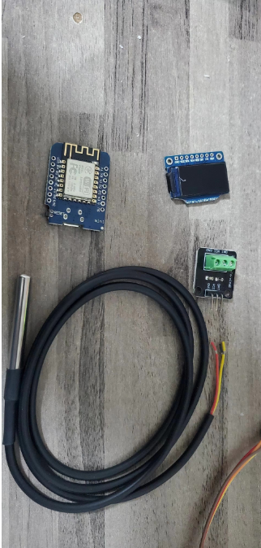
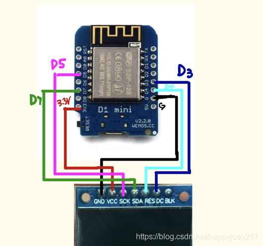
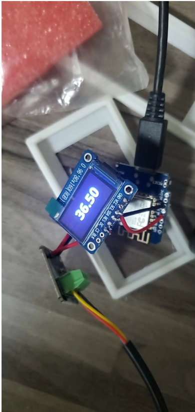
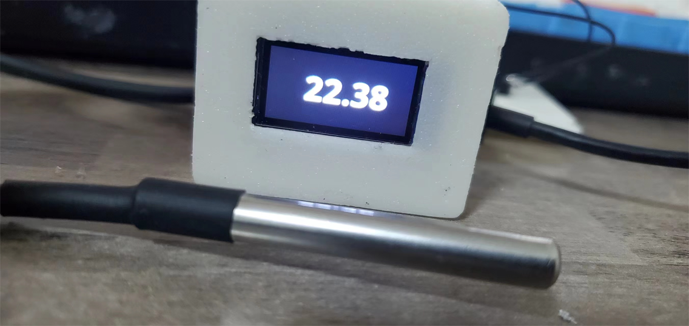

Wemos D1 mini 0.96TFT(ST7735s) DS18B20 显示温度
# st7735_DS18B20_D1Mini
`github:  https://github.com/jayxtt999/st7735_DS18B20_D1Mini`

## Wemos D1 mini  0.96TFT(ST7735s)  DS18B20 显示温度

### 元器件
- D1mini（基于esp8266的都可以，注意引脚映射关系）
- DS18B20
- 0.96寸LCD显示屏（ST7735s）

  

#### 接线

  

TFT显示屏	WemosD1Mini
SCK	                D5
SDI/MOSI/SDA    	D7
DC	                D3
RESET	            D4
GND	                GND
VCC	                3.3V

#### 焊接

  

#### 组装

  

 -- TODO ST7735S_0.96_inch_D.STL 盖板设计使用了一个4*4的按钮，用于简单控制屏幕切换和展示
