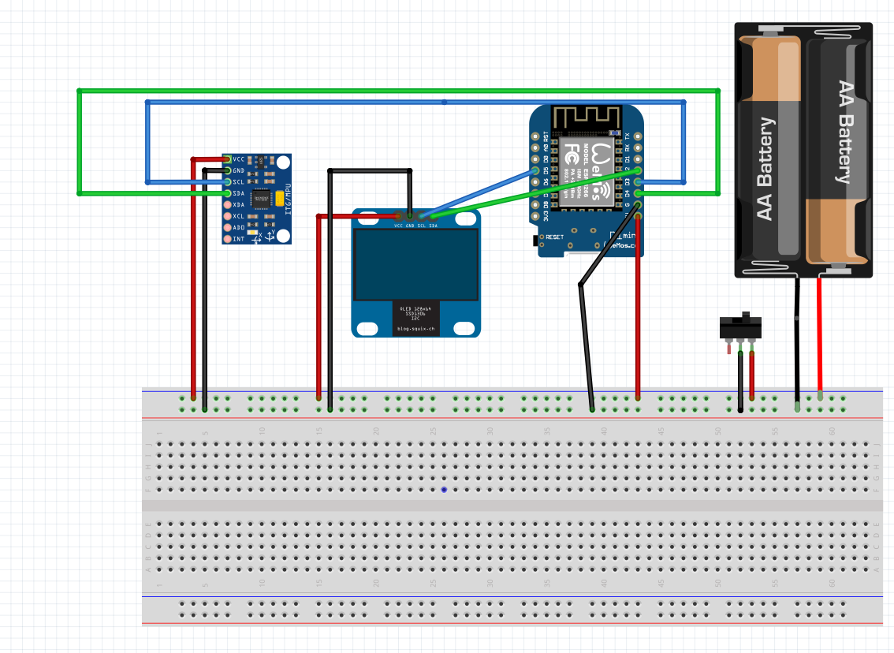
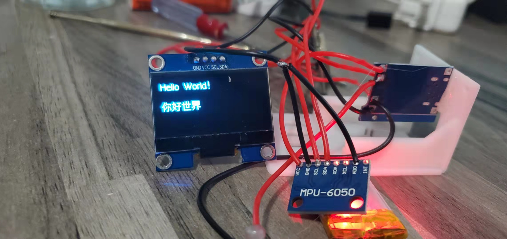
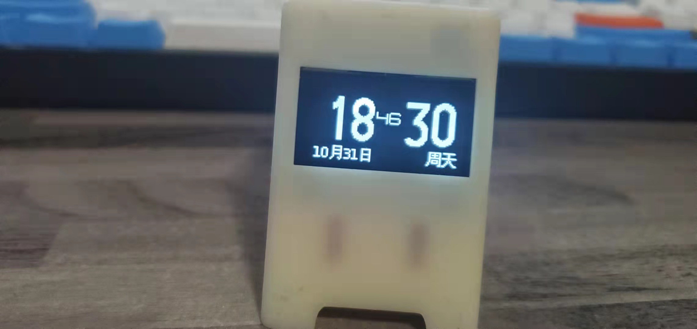
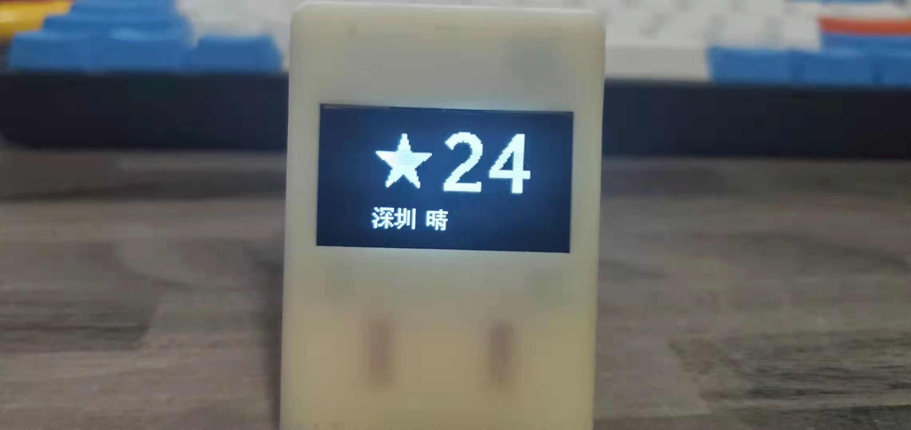
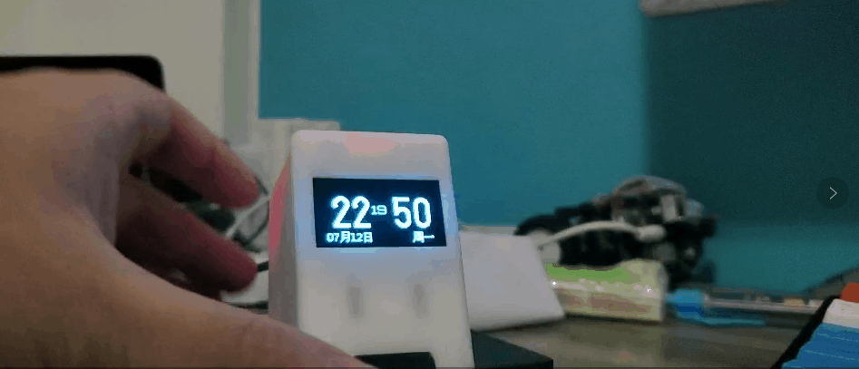

### Wemos D1 mini OLED 1.3 显示时间 天气 股票

`github: https://github.com/jayxtt999/Esp8266_Mpu6560_U8G2`

#### 外壳 元器件 程序
元器件
- D1mini（基于esp8266的都可以，注意引脚映射关系）
- mpu6050
- 1.3寸OLED显示屏（此项目基于SH1106，其实无所谓，只要能使用U8g2库就行）
- 开关螺丝杜邦线若干
- 锂电池
- 充电模块

`https://www.thingiverse.com/thing:2934049` 基于此项目的改动，使用mpu6050来替换按键切换
左倾切换为上一屏 右倾切换为下一屏 后倾则回到第一屏

#### 接线
  

D1mini    Mpu6560
D3 -> SCL
D4 -> SDA
GND -> GND
VCC -> VCC

D1mini    OLED1.3 (SH1106)
D5 -> SCL
D2 -> SDA
GND -> GND
VCC -> VCC

#### 代码需要改动项目
修改`getStockData`方法中的地址，股票数据需要搭建一个服务提供接口用于显示数据，这里使用了php在(https://github.com/jayxtt999/Esp8266_Mpu6560_U8G2_PHP)
#### 2021年11月10日 新增go版本的服务 (https://github.com/jayxtt999/ESP8266_MPU6560_U8G2_GO)

### TODO
- 倾斜切换需要调优，实际操作中不太灵敏
- 珍惜生命，远离A股[狗][狗][狗]

  

  

  

  

