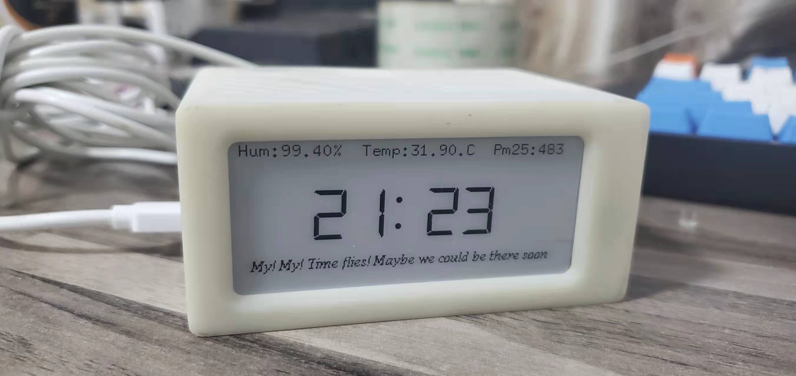

`github: https://github.com/jayxtt999/esp8266_pm7003_epaper_mymytime`

# esp8266_pm7003_epaper_mymytime
pm7003 d1mini epaper

## 所元器件需
 - d1mini or esp8266
 - goodisplay epaper
 - pms7003
 - DHT22

## 与墨水屏连接
### esp8266mcu
```
adapter esp8266mcu
CS      D8
DC      D3
RST     D4
BUSY    D2
SCK     D5
SD1     D7
```

### d1mini

```
// BUSY -> D2, RST -> D4, DC -> D3, CS -> D8, CLK -> D5, DIN -> D7, GND -> GND, 3.3V -> 3.3V
```
## 与DHT22温度传感器
```
      for DHT22
      VCC: 5V or 3V
      GND: GND
      DATA: 2

```


  


## 外壳使用了甘草`https://oshwhub.com/jie326513988/tian-qi-mo-shui-ping` 中的一个版本，但是移除了不需要的组件。建议自行二次修改

## 理论上与用微雪也行，只是大连佳显的便宜一些，且转接板与屏是分开的。
